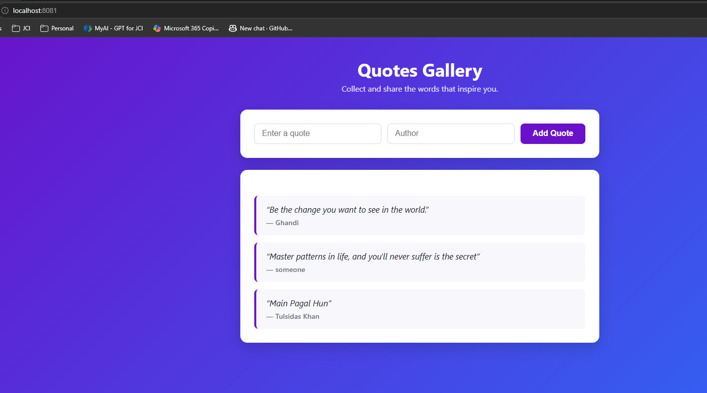

# 3-Tier Kubernetes Deployment — Quotes Application

A 3-tier Quotes application (MySQL + API + Frontend) that can run locally with Docker Compose or be deployed to Kubernetes.

- **Database (`db`)**: MySQL, seeded with [db/init.sql](db/init.sql).
- **API (`api`)**: Node.js + Express + `mysql2`, exposes `/api/quotes` (GET/POST) and `/health`. See [api/api.js](api/api.js).
- **Frontend (`app`)**: Node.js + Express + EJS, renders quotes and posts new ones via the API. See [app/app.js](app/app.js).
- **Ingress Controller**: nginx ingress, routes external traffic to the frontend.

> Previously the `api` and `app` services were written in Python/Flask. They have been rewritten in Node.js/Express.

## Prerequisites

- Docker & Docker Compose (for local development)
- Kubernetes cluster (Minikube/K3s/EKS/etc.) + `kubectl` (for deployment)
- A container registry (Docker Hub or similar) if deploying to Kubernetes

## Local Development (Docker Compose)



Build and run all three services:

```sh
docker compose build
docker compose up -d
```

Or use the helper script: [scripts/compose/compose.sh](scripts/compose/compose.sh).

- Frontend: http://localhost:5002
- API: http://localhost:5001/api/quotes

Stop everything:

```sh
docker compose down
```

Useful MySQL debugging commands are in [scripts/db/mysql-shell.sh](scripts/db/mysql-shell.sh).

## Kubernetes Deployment

Manifests live in [k8s/](k8s), organized by tier. Two helper scripts cover the whole flow below — [scripts/k8s/deploy.sh](scripts/k8s/deploy.sh) (build, import, deploy, verify, access) and [scripts/k8s/destroy.sh](scripts/k8s/destroy.sh) (tear down) — the sections underneath explain what they do step by step.

| File | Purpose |
|---|---|
| [k8s/namespaces.yaml](k8s/namespaces.yaml) | Creates the `database`, `backend`, `frontend`, `ingress-nginx` namespaces |
| [k8s/database/secret.yaml](k8s/database/secret.yaml) | MySQL credentials (`mysql-secret`), namespace: `database` |
| [k8s/database/configmap.yaml](k8s/database/configmap.yaml) | MySQL config (`mysql-config`), namespace: `database` |
| [k8s/database/statefulset.yaml](k8s/database/statefulset.yaml) | MySQL `StatefulSet` + `Service` (namespace: `database`) |
| [k8s/backend/secret.yaml](k8s/backend/secret.yaml) / [k8s/backend/configmap.yaml](k8s/backend/configmap.yaml) | Copies of the MySQL credentials/config in the `backend` namespace (Secrets/ConfigMaps are namespace-scoped, so the API can't read the `database` namespace's copies) |
| [k8s/backend/deployment.yaml](k8s/backend/deployment.yaml) | API `Deployment` + `Service` (namespace: `backend`) |
| [k8s/frontend/deployment.yaml](k8s/frontend/deployment.yaml) | Frontend `Deployment` + `Service` (namespace: `frontend`) |
| [k8s/frontend/ingress.yaml](k8s/frontend/ingress.yaml) | Ingress rule for `my.quotes.com` → frontend service |
| [k8s/ingress-nginx/controller.yaml](k8s/ingress-nginx/controller.yaml) | nginx ingress controller (Deployment, RBAC, `IngressClass`, NodePort `Service`) |

This project targets a local **k3s** cluster (e.g. running inside WSL) using images built locally with `docker compose`, not pushed to a registry.

### 1. Build images & import them into k3s

k3s runs its own `containerd`, separate from the Docker daemon, so images built with `docker compose build` aren't visible to it automatically — they have to be imported:

```sh
docker compose build --no-cache
docker save k8s-three-tier-starter-api:latest | sudo k3s ctr images import -
docker save k8s-three-tier-starter-app:latest | sudo k3s ctr images import -
docker save k8s-three-tier-starter-db:latest  | sudo k3s ctr images import -

# Verify the images landed in k3s's image store
sudo k3s ctr images ls | grep k8s-three-tier-starter
```

The manifests reference these exact image names with `imagePullPolicy: Never`, so kubelet never tries to pull from a registry. If you rebuild, re-run the `k3s ctr images import` step and roll out the change:

```sh
kubectl rollout restart deployment/quotes-api-deployment -n backend
kubectl rollout restart deployment/quotes-frontend-deployment -n frontend
```

### 2. Deploy to Kubernetes

```sh
# Namespaces first — everything else targets them
kubectl apply -f k8s/namespaces.yaml

# Apply all tiers in one command (each -f can be a directory of manifests)
kubectl apply -f k8s/database -f k8s/backend -f k8s/frontend -f k8s/ingress-nginx
```

### 3. Verify Deployment

```sh
kubectl get pods,svc -n database
kubectl get pods,svc -n backend
kubectl get pods,svc -n frontend
kubectl get pods,svc -n ingress-nginx
kubectl get ingress -n frontend

# Watch pods across all 3 app namespaces until they're Running
kubectl get pods -n database -n backend -n frontend --watch
```

If a pod is stuck (e.g. `CreateContainerConfigError`, `ImagePullBackOff`), tail its logs:

```sh
kubectl logs -n backend -l app=quotes-api --tail=100 -f
```

### 4. Access the Application

[k8s/frontend/ingress.yaml](k8s/frontend/ingress.yaml) has no `host` restriction (matches any Host header), so the simplest and most stable way in — especially on WSL, where the node IP can change — is `kubectl port-forward` straight to `localhost`:

```sh
# pick any free local port; 8080 may already be in use on your machine
kubectl port-forward -n ingress-nginx svc/ingress-nginx-controller 8081:80
```

Then, in another terminal (or the Windows browser, since WSL2 shares `localhost` with Windows):

```sh
curl http://localhost:8081
# or open http://localhost:8081 in the browser
```

No hosts-file edits and no tracking the node IP are needed — the port-forward stays valid as long as that command is running.

### Cleanup

```sh
./scripts/k8s/destroy.sh
# equivalent to:
kubectl delete -f k8s/ingress-nginx -f k8s/frontend -f k8s/backend -f k8s/database -f k8s/namespaces.yaml --ignore-not-found
```

## Notes

- `mysql-secret` and `mysql-config` must exist in **both** `database` and `backend` namespaces before deploying (Secrets/ConfigMaps don't cross namespace boundaries) — see [k8s/database/secret.yaml](k8s/database/secret.yaml) / [k8s/backend/secret.yaml](k8s/backend/secret.yaml).
- Adjust the Ingress host/rules in [k8s/frontend/ingress.yaml](k8s/frontend/ingress.yaml) based on your environment.
- All of the above is scripted in [scripts/k8s/deploy.sh](scripts/k8s/deploy.sh) — run it top to bottom, or copy/paste individual blocks as needed.